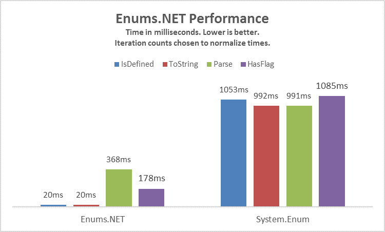

# Enums.NET
Enums.NET is a high performance type-safe .NET enum utility library which caches enum members' name, value, and attributes and provides many operations as C# extension methods for ease of use. It's currently in an RC status.

## The Woes of `System.Enum`
1. Most of its static methods are non-generic which make them a pain to use and cause boxing.
2. Most of its methods use reflection on each call without any sort of caching leading to operations being much slower than necessary.
3. Its support for flag enum operations is extremely limited. The only flag enum method on `System.Enum` is the `HasFlag` method which is extremely slow, is not type-safe, and is ambiguous as to whether it determines if the value has all or any of the specified flags.
4. It has no built-in support for retrieval of `Attribute`s applied to enum members.

Enums.NET solves all of these issues and more.

## Enums.NET Demo
    using System;
    using System.Collections.Generic;
    using System.Linq;
    using EnumsNET;
    using NUnit.Framework;
    using DescriptionAttribute = System.ComponentModel.DescriptionAttribute;

    [TestFixture]
    class EnumsNETDemo
    {
        // Test enum definitions at the bottom

        [Test]
        public void Enumerate()
        {
            // Retrieves enum members in increasing value order
            foreach (EnumMember<NumericOperator> member in Enums.GetEnumMembers<NumericOperator>())
            {
                NumericOperator value = member.Value;
                string name = member.Name;
                // Do stuff
            }
            Assert.AreEqual(8, Enums.GetEnumMembers<NumericOperator>().Count());
            Assert.AreEqual(6, Enums.GetEnumMembers<NumericOperator>(excludeDuplicates: true).Count());
        }

        [Test]
        public void Validate()
        {
            // Standard Enums, checks is defined
            Assert.IsTrue(NumericOperator.LessThan.IsValid());
            Assert.IsFalse(((NumericOperator)20).IsValid());

            // Flag Enums, checks is valid flag combination or is defined
            Assert.IsTrue((DaysOfWeek.Sunday | DaysOfWeek.Wednesday).IsValid());
            Assert.IsFalse((DaysOfWeek.Sunday | DaysOfWeek.Wednesday | ((DaysOfWeek)(-1))).IsValid());

            // Custom validation through IEnumValidatorAttribute
            Assert.IsTrue(DayType.Weekday.IsValid());
            Assert.IsTrue((DayType.Weekday | DayType.Holiday).IsValid());
            Assert.IsFalse((DayType.Weekday | DayType.Weekend).IsValid());
        }

        [Test]
        public void FlagEnumOperations()
        {
            // CombineFlags ~ bitwise OR
            Assert.AreEqual(DaysOfWeek.Monday | DaysOfWeek.Wednesday, DaysOfWeek.Monday.CombineFlags(DaysOfWeek.Wednesday));
            Assert.AreEqual(DaysOfWeek.Monday | DaysOfWeek.Wednesday | DaysOfWeek.Friday, FlagEnums.CombineFlags(DaysOfWeek.Monday, DaysOfWeek.Wednesday, DaysOfWeek.Friday));

            // HasAnyFlags
            Assert.IsTrue(DaysOfWeek.Monday.HasAnyFlags(DaysOfWeek.Monday | DaysOfWeek.Wednesday));
            Assert.IsFalse((DaysOfWeek.Monday | DaysOfWeek.Wednesday).HasAnyFlags(DaysOfWeek.Friday));

            // HasAllFlags
            Assert.IsTrue((DaysOfWeek.Monday | DaysOfWeek.Wednesday | DaysOfWeek.Friday).HasAllFlags(DaysOfWeek.Monday | DaysOfWeek.Wednesday));
            Assert.IsFalse(DaysOfWeek.Monday.HasAllFlags(DaysOfWeek.Monday | DaysOfWeek.Wednesday));

            // CommonFlags ~ bitwise AND
            Assert.AreEqual(DaysOfWeek.Monday, DaysOfWeek.Monday.CommonFlags(DaysOfWeek.Monday | DaysOfWeek.Wednesday));
            Assert.AreEqual(DaysOfWeek.None, DaysOfWeek.Monday.CommonFlags(DaysOfWeek.Wednesday));

            // RemoveFlags
            Assert.AreEqual(DaysOfWeek.Wednesday, (DaysOfWeek.Monday | DaysOfWeek.Wednesday).RemoveFlags(DaysOfWeek.Monday));
            Assert.AreEqual(DaysOfWeek.None, (DaysOfWeek.Monday | DaysOfWeek.Wednesday).RemoveFlags(DaysOfWeek.Monday | DaysOfWeek.Wednesday));

            // GetFlags, splits out the individual flags in increasing value order
            List<DaysOfWeek> flags = DaysOfWeek.Weekend.GetFlags().ToList();
            Assert.AreEqual(2, flags.Count);
            Assert.AreEqual(DaysOfWeek.Sunday, flags[0]);
            Assert.AreEqual(DaysOfWeek.Saturday, flags[1]);

            // GetAllFlags
            Assert.AreEqual(DaysOfWeek.All, FlagEnums.GetAllFlags<DaysOfWeek>());
        }

        [Test]
        public void Name()
        {
            Assert.AreEqual("Equals", NumericOperator.Equals.GetName());
            Assert.IsNull(((NumericOperator)(-1)).GetName());
        }

        [Test]
        public void Attributes()
        {
            Assert.IsTrue(NumericOperator.GreaterThanOrEquals.GetEnumMember().HasAttribute<PrimaryEnumMemberAttribute>());
            Assert.IsFalse(Enums.GetEnumMember<NumericOperator>("NotLessThan").HasAttribute<PrimaryEnumMemberAttribute>());
            Assert.AreEqual("Is not", NumericOperator.NotEquals.GetEnumMember().GetAttribute<DescriptionAttribute>().Description);
            Assert.IsNull(NumericOperator.LessThan.GetEnumMember().GetAttribute<DescriptionAttribute>());
        }

        [Test]
        public void Parsing()
        {
            Assert.AreEqual(NumericOperator.GreaterThan, Enums.Parse<NumericOperator>("GreaterThan"));
            Assert.AreEqual(NumericOperator.NotEquals, Enums.Parse<NumericOperator>("1"));
            Assert.AreEqual(NumericOperator.Equals, Enums.Parse<NumericOperator>("Is", EnumFormat.Description));

            Assert.AreEqual(DaysOfWeek.Monday | DaysOfWeek.Wednesday, Enums.Parse<DaysOfWeek>("Monday, Wednesday"));
            Assert.AreEqual(DaysOfWeek.Tuesday | DaysOfWeek.Thursday, FlagEnums.ParseFlags<DaysOfWeek>("Tuesday | Thursday", delimiter: "|"));
        }

        [Test]
        public void Description()
        {
            Assert.AreEqual("Is", NumericOperator.Equals.AsString(EnumFormat.Description));
            Assert.IsNull(NumericOperator.LessThan.AsString(EnumFormat.Description));
        }

        [Test]
        public void CustomEnumFormat()
        {
            EnumFormat symbolFormat = Enums.RegisterCustomEnumFormat(member => member.GetAttribute<SymbolAttribute>()?.Symbol);
            Assert.AreEqual(">", NumericOperator.GreaterThan.AsString(symbolFormat));
            Assert.AreEqual(NumericOperator.LessThan, Enums.Parse<NumericOperator>("<", symbolFormat));
        }

        enum NumericOperator
        {
            [Description("Is")]
            [Symbol("=")]
            Equals,
            [Description("Is not")]
            [Symbol("!=")]
            NotEquals,
            [Symbol("<")]
            LessThan,
            [PrimaryEnumMember] // Indicates enum member as primary duplicate for extension methods
            [Symbol(">=")]
            GreaterThanOrEquals,
            NotLessThan = GreaterThanOrEquals,
            [Symbol(">")]
            GreaterThan,
            [PrimaryEnumMember]
            [Symbol("<=")]
            LessThanOrEquals,
            NotGreaterThan = LessThanOrEquals
        }

        [Flags]
        enum DaysOfWeek
        {
            None = 0,
            Sunday = 1,
            Monday = 2,
            Tuesday = 4,
            Wednesday = 8,
            Thursday = 16,
            Friday = 32,
            Weekdays = Monday | Tuesday | Wednesday | Thursday | Friday,
            Saturday = 64,
            Weekend = Sunday | Saturday,
            All = Sunday | Monday | Tuesday | Wednesday | Thursday | Friday | Saturday
        }

        [Flags]
        [DayTypeValidator]
        enum DayType
        {
            Weekday = 1,
            Weekend = 2,
            Holiday = 4
        }

        [AttributeUsage(AttributeTargets.Field)]
        class SymbolAttribute : Attribute
        {
            public string Symbol { get; }

            public SymbolAttribute(string symbol)
            {
                Symbol = symbol;
            }
        }

        [AttributeUsage(AttributeTargets.Enum)]
        class DayTypeValidatorAttribute : Attribute, IEnumValidatorAttribute<DayType>
        {
            public bool IsValid(DayType value) => value == DayType.Weekday || value == DayType.Weekend || value == (DayType.Weekday | DayType.Holiday) || value == (DayType.Weekend | DayType.Holiday);
        }
    }

## Performance Comparison

## How Is It Type-Safe
There is currently no way to constrain a type or method's generic type parameter to an enum in C#. This is a limitation the C# compiler imposes, not a limitation of the CLR itself thus a valid .NET assembly can contain these constraints. How this library works is that the C# compiler can understand when this constraint is applied, it just can't express it. Utilizing Simon Cropp's Fody, on build a post-processing step is applied to the compiled Enums.NET assembly to add these constraints to the assembly, thus achieving type safety.

## Interface
`EnumsNET.Enums` static class for type-safe standard enum operations, with many exposed as C# extension methods.

`EnumsNET.FlagEnums` static class for type-safe flag enum operations, with many exposed as C# extension methods.

`EnumsNET.Unsafe.UnsafeEnums` static class for standard enum operations without the enum constraint for use in generic programming.

`EnumsNET.Unsafe.UnsafeFlagEnums` static class for flag enum operations without the enum constraint for use in generic programming.

`EnumsNET.NonGeneric.NonGenericEnums` static class for non-generic standard enum operations, mostly a superset of .NET's `System.Enum` class.

`EnumsNET.NonGeneric.NonGenericFlagEnums` static class for non-generic flag enum operations.

## Requirements
.NET Framework 2.0+ or .NET Standard 1.0+

## Credits
Inspired by Jon Skeet's [Unconstrained Melody] (https://github.com/jskeet/unconstrained-melody)

Uses Simon Cropp's [Fody] (https://github.com/Fody/Fody) & [Fody.ExtraConstraints] (https://github.com/Fody/ExtraConstraints) which is built on Jb Evain's [Mono.Cecil] (https://github.com/jbevain/cecil)

Uses modified build scripts and repository structure from James Newton-King's [Json.NET] (https://github.com/JamesNK/Newtonsoft.Json)
