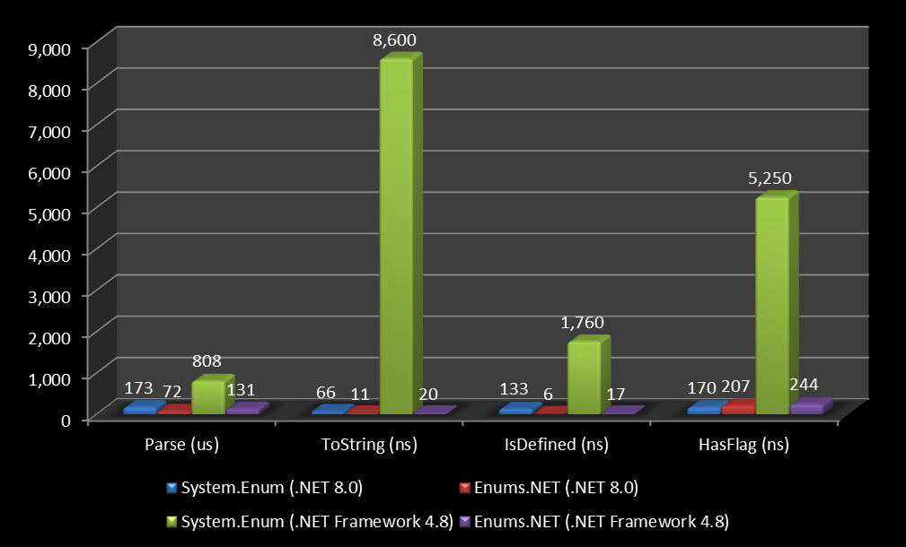

# Enums.NET
Enums.NET is a high-performance type-safe .NET enum utility library which provides many operations as convenient extension methods. It is available as a [NuGet Package](https://www.nuget.org/packages/Enums.NET/) and is compatible with .NET Framework 2.0+ and .NET Standard 1.0+.

I'm trying to integrate some of Enums.NET's improvements into [corefx](https://github.com/dotnet/corefx) so if interested in its progress please check out the proposal [here](https://github.com/dotnet/corefx/issues/15453).

## What's wrong with `System.Enum`
1. Nearly all of `Enum`'s static methods are non-generic leading to the following issues.
   * Requires the enum type to be explicitly specified as an argument and requires invocation using static method syntax such as `Enum.IsDefined(typeof(ConsoleColor), value)` instead of what should be `value.IsDefined()`.
   * Requires casting/unboxing for methods with an enum return value, eg. `ToObject`, `Parse`, and `GetValues`.
   * Requires boxing for methods with enum input parameters losing type-safety, eg. `IsDefined` and `GetName`.
2. Support for flag enums is limited to just the `HasFlag` method which isn't type-safe, is inefficient, and is ambiguous as to whether it determines if the value has all or any of the specified flags. It's all by the way.
3. Most of its methods use reflection on each call without any sort of caching causing poor performance.
4. The pattern to associate extra data with an enum member using `Attribute`s is not supported and instead requires users to manually retrieve the `Attribute`s via reflection. This pattern is commonly used on enum members with the `DescriptionAttribute`, `EnumMemberAttribute`, and `DisplayAttribute`.

Enums.NET solves all of these issues and more.

## Enums.NET Demo

```cs
using System;
using System.Linq;
using EnumsNET;
using NUnit.Framework;
using DescriptionAttribute = System.ComponentModel.DescriptionAttribute;

[TestFixture]
class EnumsNETDemo
{
    // Enum definitions at bottom

    [Test]
    public void Enumerate()
    {
        var count = 0;
        // Retrieves all enum members in increasing value order
        foreach (var member in Enums.GetMembers<NumericOperator>())
        {
            NumericOperator value = member.Value;
            string name = member.Name;
            AttributeCollection attributes = member.Attributes;
            ++count;
        }
        Assert.AreEqual(8, count);

        count = 0;
        // Retrieves distinct values in increasing value order
        foreach (var value in Enums.GetValues<NumericOperator>(EnumMemberSelection.Distinct))
        {
            string name = value.GetName();
            AttributeCollection attributes = value.GetAttributes();
            ++count;
        }
        Assert.AreEqual(6, count);
    }

    [Test]
    public void FlagEnumOperations()
    {
        // HasAllFlags
        Assert.IsTrue((DaysOfWeek.Monday | DaysOfWeek.Wednesday | DaysOfWeek.Friday).HasAllFlags(DaysOfWeek.Monday | DaysOfWeek.Wednesday));
        Assert.IsFalse(DaysOfWeek.Monday.HasAllFlags(DaysOfWeek.Monday | DaysOfWeek.Wednesday));

        // HasAnyFlags
        Assert.IsTrue(DaysOfWeek.Monday.HasAnyFlags(DaysOfWeek.Monday | DaysOfWeek.Wednesday));
        Assert.IsFalse((DaysOfWeek.Monday | DaysOfWeek.Wednesday).HasAnyFlags(DaysOfWeek.Friday));

        // CombineFlags ~ bitwise OR
        Assert.AreEqual(DaysOfWeek.Monday | DaysOfWeek.Wednesday, DaysOfWeek.Monday.CombineFlags(DaysOfWeek.Wednesday));
        Assert.AreEqual(DaysOfWeek.Monday | DaysOfWeek.Wednesday | DaysOfWeek.Friday, FlagEnums.CombineFlags(DaysOfWeek.Monday, DaysOfWeek.Wednesday, DaysOfWeek.Friday));

        // CommonFlags ~ bitwise AND
        Assert.AreEqual(DaysOfWeek.Monday, DaysOfWeek.Monday.CommonFlags(DaysOfWeek.Monday | DaysOfWeek.Wednesday));
        Assert.AreEqual(DaysOfWeek.None, DaysOfWeek.Monday.CommonFlags(DaysOfWeek.Wednesday));

        // RemoveFlags
        Assert.AreEqual(DaysOfWeek.Wednesday, (DaysOfWeek.Monday | DaysOfWeek.Wednesday).RemoveFlags(DaysOfWeek.Monday));
        Assert.AreEqual(DaysOfWeek.None, (DaysOfWeek.Monday | DaysOfWeek.Wednesday).RemoveFlags(DaysOfWeek.Monday | DaysOfWeek.Wednesday));

        // GetFlags, splits out the individual flags in increasing significance bit order
        var flags = DaysOfWeek.Weekend.GetFlags().ToList();
        Assert.AreEqual(2, flags.Count);
        Assert.AreEqual(DaysOfWeek.Sunday, flags[0]);
        Assert.AreEqual(DaysOfWeek.Saturday, flags[1]);
    }

    [Test]
    public new void ToString()
    {
        // AsString, equivalent to ToString
        Assert.AreEqual("Equals", NumericOperator.Equals.AsString());
        Assert.AreEqual("-1", ((NumericOperator)(-1)).AsString());

        // GetName
        Assert.AreEqual("Equals", NumericOperator.Equals.GetName());
        Assert.IsNull(((NumericOperator)(-1)).GetName());

        // Get description
        Assert.AreEqual("Is", NumericOperator.Equals.AsString(EnumFormat.Description));
        Assert.IsNull(NumericOperator.LessThan.AsString(EnumFormat.Description));

        // Get description if applied, otherwise the name
        Assert.AreEqual("LessThan", NumericOperator.LessThan.AsString(EnumFormat.Description, EnumFormat.Name));
    }

    [Test]
    public void Validate()
    {
        // Standard Enums, checks is defined
        Assert.IsTrue(NumericOperator.LessThan.IsValid());
        Assert.IsFalse(((NumericOperator)20).IsValid());

        // Flag Enums, checks is valid flag combination or is defined
        Assert.IsTrue((DaysOfWeek.Sunday | DaysOfWeek.Wednesday).IsValid());
        Assert.IsFalse((DaysOfWeek.Sunday | DaysOfWeek.Wednesday | ((DaysOfWeek)(-1))).IsValid());

        // Custom validation through IEnumValidatorAttribute<TEnum>
        Assert.IsTrue(DayType.Weekday.IsValid());
        Assert.IsTrue((DayType.Weekday | DayType.Holiday).IsValid());
        Assert.IsFalse((DayType.Weekday | DayType.Weekend).IsValid());
    }

    [Test]
    public void CustomEnumFormat()
    {
        EnumFormat symbolFormat = Enums.RegisterCustomEnumFormat(member => member.Attributes.Get<SymbolAttribute>()?.Symbol);
        Assert.AreEqual(">", NumericOperator.GreaterThan.AsString(symbolFormat));
        Assert.AreEqual(NumericOperator.LessThan, Enums.Parse<NumericOperator>("<", symbolFormat));
    }

    [Test]
    public void Attributes()
    {
        Assert.AreEqual("!=", NumericOperator.NotEquals.GetAttributes().Get<SymbolAttribute>().Symbol);
        Assert.IsTrue(NumericOperator.GreaterThanOrEquals.GetAttributes().Has<PrimaryEnumMemberAttribute>());
        Assert.IsFalse(NumericOperator.LessThan.GetAttributes().Has<DescriptionAttribute>());
    }

    [Test]
    public void Parsing()
    {
        Assert.AreEqual(NumericOperator.GreaterThan, Enums.Parse<NumericOperator>("GreaterThan"));
        Assert.AreEqual(NumericOperator.NotEquals, Enums.Parse<NumericOperator>("1"));
        Assert.AreEqual(NumericOperator.Equals, Enums.Parse<NumericOperator>("Is", EnumFormat.Description));

        Assert.AreEqual(DaysOfWeek.Monday | DaysOfWeek.Wednesday, Enums.Parse<DaysOfWeek>("Monday, Wednesday"));
        Assert.AreEqual(DaysOfWeek.Tuesday | DaysOfWeek.Thursday, FlagEnums.ParseFlags<DaysOfWeek>("Tuesday | Thursday", delimiter: "|"));
    }

    enum NumericOperator
    {
        [Symbol("="), Description("Is")]
        Equals,
        [Symbol("!="), Description("Is not")]
        NotEquals,
        [Symbol("<")]
        LessThan,
        [Symbol(">="), PrimaryEnumMember] // PrimaryEnumMember indicates enum member as primary duplicate for extension methods
        GreaterThanOrEquals,
        NotLessThan = GreaterThanOrEquals,
        [Symbol(">")]
        GreaterThan,
        [Symbol("<="), PrimaryEnumMember]
        LessThanOrEquals,
        NotGreaterThan = LessThanOrEquals
    }

    [AttributeUsage(AttributeTargets.Field)]
    class SymbolAttribute : Attribute
    {
        public string Symbol { get; }

        public SymbolAttribute(string symbol)
        {
            Symbol = symbol;
        }
    }

    [Flags]
    enum DaysOfWeek
    {
        None = 0,
        Sunday = 1,
        Monday = 2,
        Tuesday = 4,
        Wednesday = 8,
        Thursday = 16,
        Friday = 32,
        Weekdays = Monday | Tuesday | Wednesday | Thursday | Friday,
        Saturday = 64,
        Weekend = Sunday | Saturday,
        All = Sunday | Monday | Tuesday | Wednesday | Thursday | Friday | Saturday
    }

    [Flags, DayTypeValidator]
    enum DayType
    {
        Weekday = 1,
        Weekend = 2,
        Holiday = 4
    }

    [AttributeUsage(AttributeTargets.Enum)]
    class DayTypeValidatorAttribute : Attribute, IEnumValidatorAttribute<DayType>
    {
        public bool IsValid(DayType value) => value.GetFlagCount(DayType.Weekday | DayType.Weekend) == 1 && FlagEnums.IsValidFlagCombination(value);
    }
}
```

## Performance Comparison


## Interface
[`EnumsNET.Enums`](Src/Enums.NET/Enums.cs) static class for type-safe enum operations, with many exposed as extension methods.

[`EnumsNET.FlagEnums`](Src/Enums.NET/FlagEnums.cs) static class for type-safe flag enum operations, with many exposed as extension methods.

[`EnumsNET.UnsafeEnums`](Src/Enums.NET/Unsafe/UnsafeEnums.cs) static class for enum operations without the enum constraint for use in generic programming.

[`EnumsNET.UnsafeFlagEnums`](Src/Enums.NET/Unsafe/UnsafeFlagEnums.cs) static class for flag enum operations without the enum constraint for use in generic programming.

[`EnumsNET.NonGeneric.NonGenericEnums`](Src/Enums.NET/NonGeneric/NonGenericEnums.cs) static class for non-generic enum operations.

[`EnumsNET.NonGeneric.NonGenericFlagEnums`](Src/Enums.NET/NonGeneric/NonGenericFlagEnums.cs) static class for non-generic flag enum operations.

## Credits
Inspired by Jon Skeet's [Unconstrained Melody](https://github.com/jskeet/unconstrained-melody).

Uses Simon Cropp's [Fody](https://github.com/Fody/Fody) which is built on Jb Evain's [Mono.Cecil](https://github.com/jbevain/cecil) for building the assembly.
